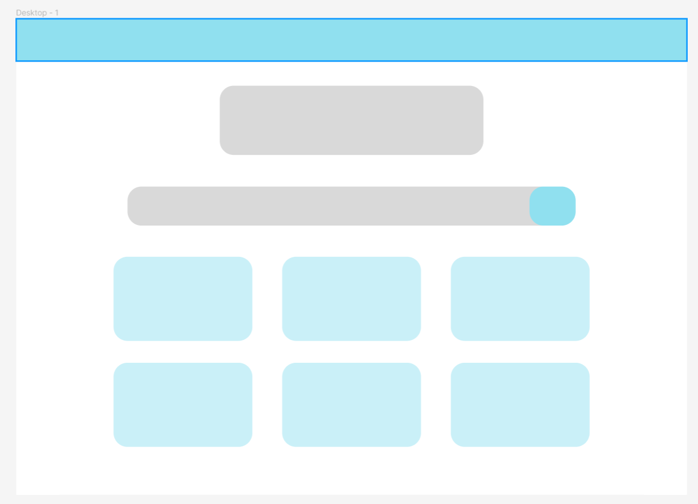
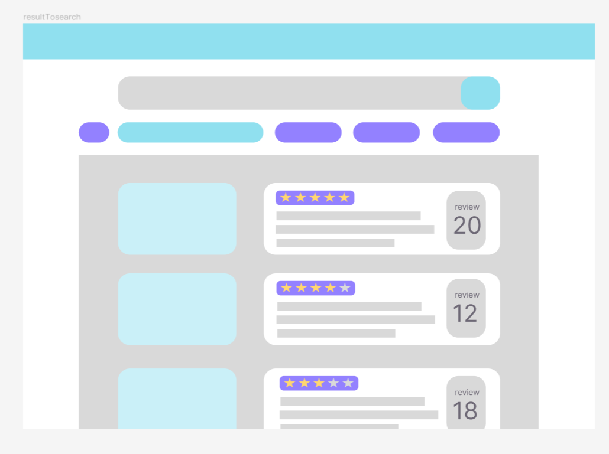
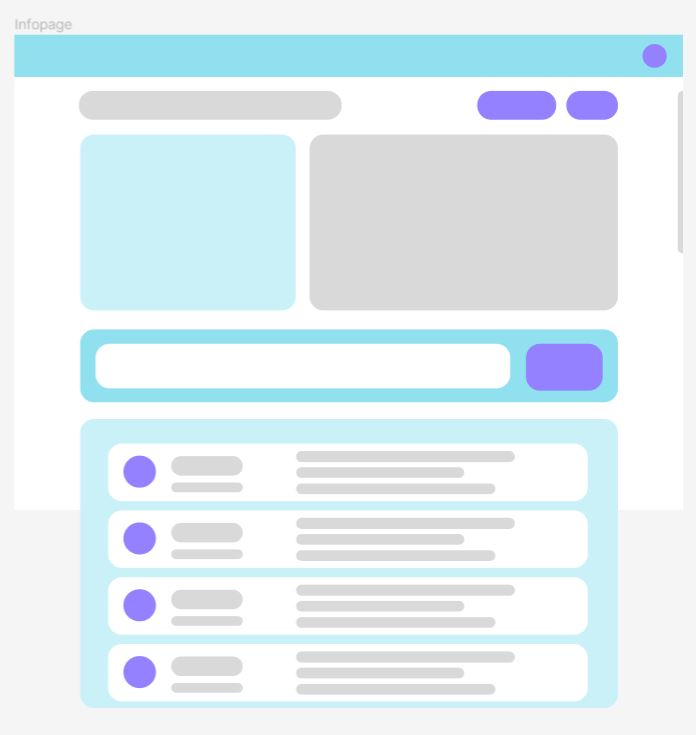

<!-- # Roomlulala
1. main image   
></img> 
2. list image   
></img> 
3. info image   
></img> 

https://i-ri.tistory.com/39
https://choa-ri.tistory.com/74 -->

* 구현한 기능
CRUD

[LINK]: <https://github.com/4BFC/Roomlulala_project/blob/master/Roomlulala/info/js/app.js>
    
Google map 임베드 코드

[LINK]: <https://codingdaisy.tistory.com/50>
     
검색 기능 
    
[LINK]: <https://github.com/4BFC/Roomlulala_project/blob/master/Roomlulala/main/test/test_search/search.js>
    
별점 기능 
    
[LINK]: <https://github.com/4BFC/Roomlulala_project/blob/master/Roomlulala/info/test/Star_test/app.js>
    
로그인 기능 
    
[LINK]: <https://github.com/4BFC/Roomlulala_project/blob/master/Roomlulala/info/test/Star_test/app.js>
    
    
    
* 아쉬웠던 점
> Github : 깃 허브 브런치를 좀더 적극 적으로 활용했으면 파일을들을 더욱 잘 분산해서 사용 했을 수 있었는데 잘 안되서 아쉽다.
> api : api를 적극적으로 사용하지 못한 점이 아쉬웠다. api를 사용해서 사용자 정보를 가져왔다면 더욱 다양하게 활용했을 것 같다.
> 구성 : info파일 부분에서 js를 너무 많이 부분별로 나뉜거 같아서 조금은 복잡해 보였다.
    

* 보완해야 할 점
> info    별점기능을 test버전으로 만들긴 했으나 완벽히 구현하지 못한 것.   로그인 구현에 따른 댓글관리 시스템 구축이 미약하다.    
    
> 세부적인 페이지 구현이 미약해서 보완이 필요하다..
    
> 전반적으로 재점검하면서 실제 사이트를 이용할 수 있는 정보들을 우선순위로 리패토링 해볼 필요가 있다.
   
> css에서 transition이 들어가서 더욱 자연스러운 UX를 연출하는 부분에 보완이 필요하다.
   
> 사용자에게 도움이되는 서비스로 개선할 필요가 있다.
    

* 마무리를 지으며
> 프로젝트가 우리의 의도와는 달리 완성도가 높지는 않았지만 생각과 정보를 공유하면서 진행 과정들이 만족스러웠다. 이를 기반으로 공부를 하고 싶은 재미가 생겼다. 구체적으론 효율적인 코딩 방식에 관심이 생겼고 이론들을 공부하면서 코드에 대입해 보고 싶다.
    
> 각자 개인 프로젝트로 웹 사이트를 만들어서 코드를 리뷰하는 방식으로 스터디를 해도 좋을 듯하다.